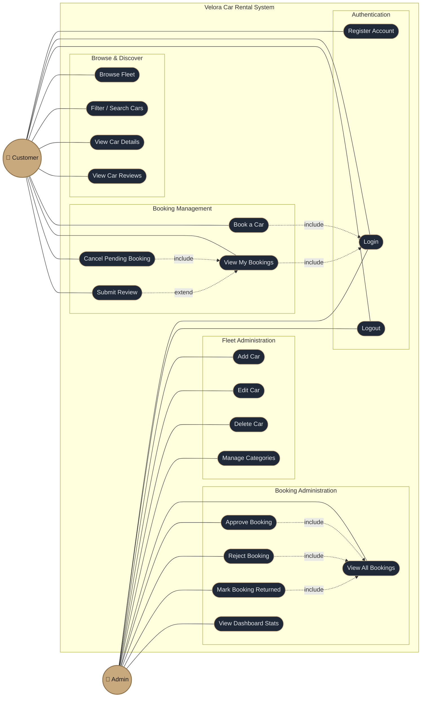

# Velora — Use Case Diagram

Actors and their interactions with the Velora luxury car rental system.

## Actor Summary

| Actor | Role | Access |
|-------|------|--------|
| **Customer** | End user renting vehicles | Public routes + `/`, `/booking/:carId`, `/my-bookings` |
| **Admin** | System operator | `/admin`, `/admin/bookings` |

## Business Rules Reflected

- Registration is open only to customers; admin accounts are pre-provisioned.
- A customer may cancel a booking **only while it is `PENDING`**. Once approved, only an admin can transition it (to `RETURNED` or terminal states).
- A review can be submitted **only after a booking reaches `RETURNED`** and only once per booking.
- Booking state machine: `PENDING → APPROVED → RETURNED`, with `REJECTED` / `CANCELLED` as terminal alternatives. Car status mirrors this: `RESERVED → RENTED → AVAILABLE`.
